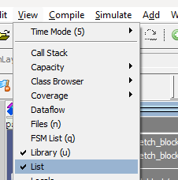
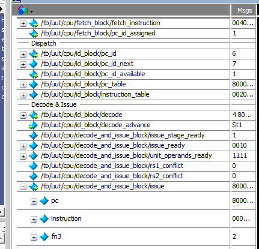
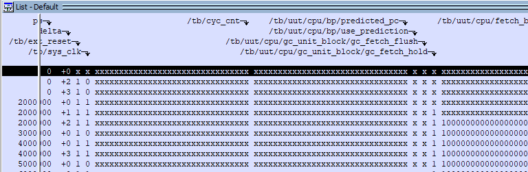
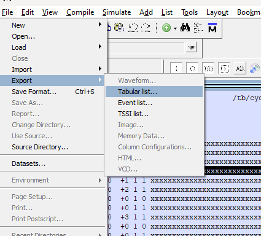
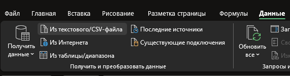
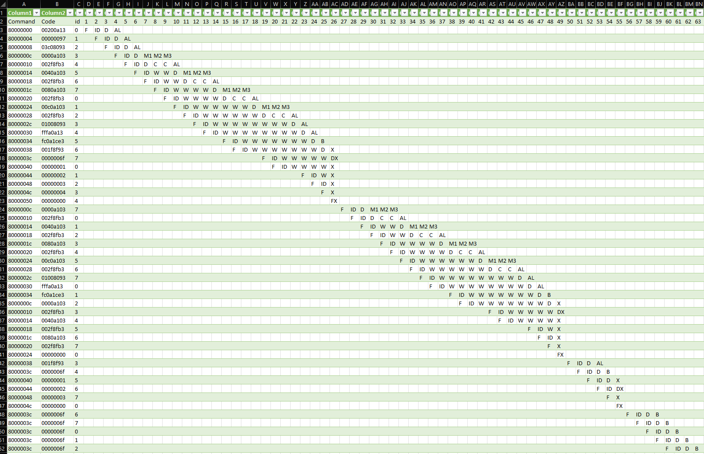

# riscv-lab-pipeline-generator
Скрипт для генерации трассы выполнения программы на микропроцессорном ядре Taiga для [ЛР1 Изучение принципов работы микропроцессорного ядра RISC-V](https://gitlab.com/sibragimov/riscv-lab/-/blob/main/main.adoc) 

## Использование

### Получение входных данных

1. Запустить симуляцию в среде Modelsim (см. методичку по лабораторной работе)
2. Экспортировать данные симуляции:
   1. Активировать окно `List`: вкладка `View` -> `List`
      
   2. Выделить все сигналы (`Ctrl+A`) на Wave-диаграмме и скопировать (`Ctrl+C`)
      
   3. Перейти на вкладку `List` и вставить все сигналы (`Ctrl+V`)
      
   4. Экспортировать: `File` -> `Export` -> `Tabular list...` и сохранить в виде файла формата `.lst`
      

### Результаты в формате CSV

1. Запустить `generate_pipeline_csv.py VarX.lst` (входной файл должен быть первым аргументом; как вариант, перетащить файл с входнымми данными на файл скрипта)
2. Результаты будут в файле с названием входного файла и формата `.csv`
3. (_опционально_) Импортировать в Excel: `Данные` -> `Из текстового/CSV-файла`
   

### Результаты в формате XLSX

1. Установить `pandas` и `xlsxwriter`:
```
pip install pandas xlsxwriter
```
2. Аналогично запустить `generate_pipeline_xlsx.py VarX.lst`
3. Результаты будут в файле с названием входного файла и формата `.xlsx`

